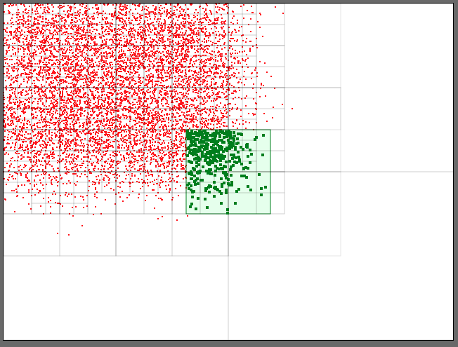

# Random points and Quad Tree

> Random points `Point(x,y)` generated on a canvas to demonstrate how collision works
> when using a Quad Tree `QuadTree(area, maxDepth, maxPoints)`.




```
npm install
npm run dev
open http://127.0.0.1:8000/
```
