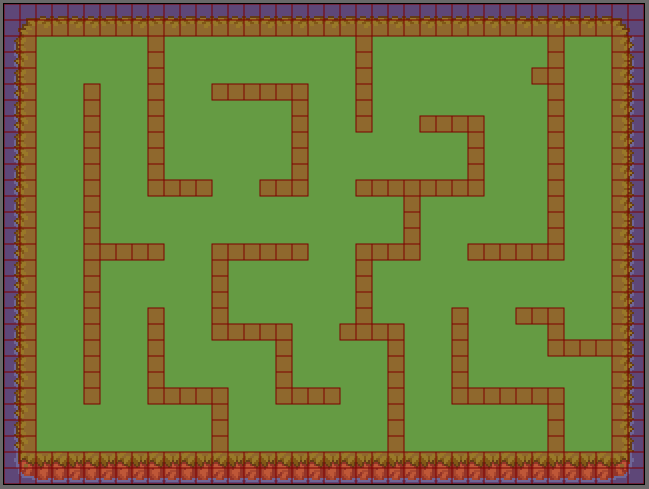
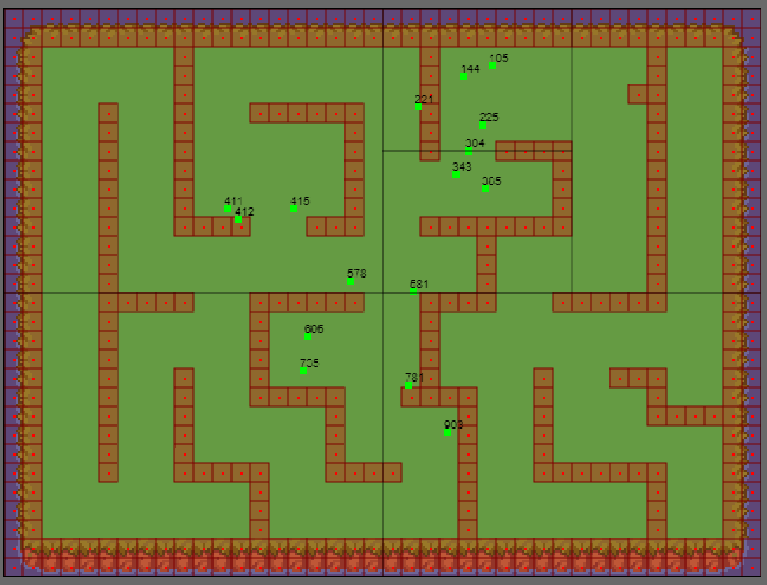

# Rendering based on Tiled (json) map.

> Rendering multiple layers (background, foreground), pre-rendering the background.

Example of rendering individual tiles:  

Example of rendering collision tiles:  

Example of random points moving on a static grid
interacting with themselves and colliding with static tiles:  
