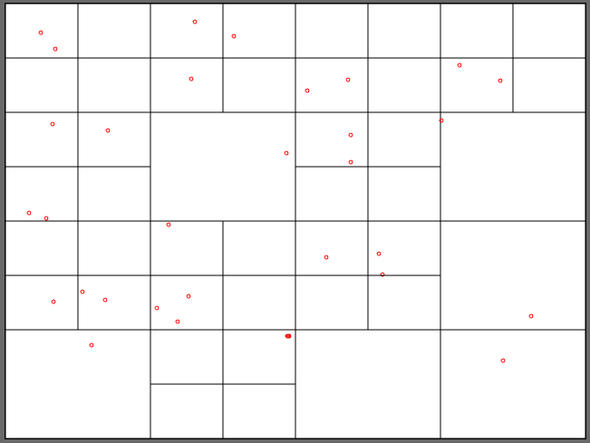
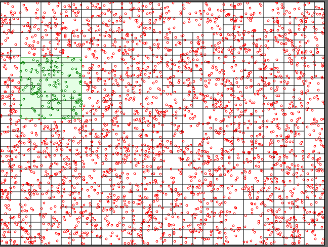

# Quadtree

> Quadtree implementation & demo

## Usage

```ts
const area = new Rectangle(640, 480, new Point(640/2, 480/2));
const quadtree = new QuadTree(area, 3, 3);

const queryArea = new Rectangle(120, 120, new Point(randomInt(0, 640), randomInt(0, 480)));
const pointsFound = quadtree.query(queryArea);
```

## Examples

Run demo with:

```shell
npm run demo # then go to http://127.0.0.1:8000/
```

Quadtree line example


Quadtree with maxDepth=3




Query on quadtree with maxDepth=10 (3000 points)



## Test

```shell
npx vitest --coverage
```
